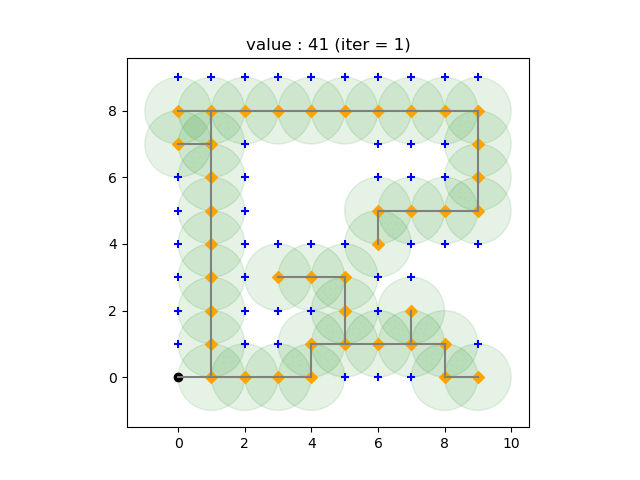

# K-cover-Metaheuristic
In this repo, two methods are presented to solve a K-minimum cover with Metaheuristics algorithms.
* An Evolutionary Algorithm 
* A Local Search

<p align="center">
    
</p>
<div align="center"> Evolution of the best current solution at each iteration, with Evolutionary Algorithm
</div>

## How to run the project 
To run the project you need to run 
```bash
python  main.py
```
Needed Arguments :
- `-m` for the method to run. Chose between `genetic, local, bound`
- `-d` for the path of the input data file 

Parameters of the instance (defaults to `(1, 1, 1)`)
- `-rcapt` for the captation radius (int)
- `-rcomm` for the communication radius (int)
- `-k` for the cover degree (int)

Optional Hyper-Parameters (defaults to `(40, 15)`)
- `-neighb` for the maximum number of neighbours (for local searchs)
- `-i` for the maximum number of iterations (int)

Optional Parameters (defaults to `False`)
- `--stats` : add this option if you want output plots to be showed after the search
- `--optim` : only used in `bash` files, to run multiple instances in a row

### Command examples per method
- To test the Evolutionary Algorithm Method, you can run 

```bash
python main.py -m genetic -d data/captANOR150_7_4.dat -rcom 2 -rcapt 1 -k 1 -i 10 -neighb 40 --stats
```

- To test the Local Search Method, you can run 

```bash
python main.py -m localsearch -d data/captANOR150_7_4.dat -rcom 2 -rcapt 1 -k 1 -i 15 -neighb 40 -t 400 --stats```